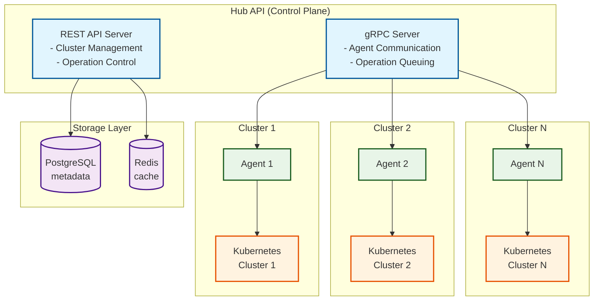

# Multi-Cluster Kubernetes Management Tools (MCKMT)

Comprehensive toolkit for managing multiple Kubernetes clusters from a central control plane (hub).

## ⚠️ Disclaimer

**This is a hobby project created for learning purposes.** While the implementation is functional and follows production-ready patterns, it should be used with caution in production environments. The project demonstrates:

- Clean Architecture principles in Go
- Multi-cluster Kubernetes management concepts
- gRPC and REST API design
- Database design and caching strategies
- Authentication and authorization patterns
- Monitoring and observability implementation

**However, it is actually usable** and can serve as a solid foundation for a real multi-cluster management system with proper testing, security review, and production hardening.

## Table of Contents

- [Features](#features)
  - [Implemented](#-implemented)
  - [In Progress / Partial](#-in-progress--partial)
  - [Planned](#-planned)
- [Quick Start](#quick-start)
  - [Prerequisites](#prerequisites)
  - [Examples & Demos](#examples--demos)
  - [Quick Kind Demo (Recommended)](#quick-kind-demo-recommended)
  - [Using Docker Compose](#using-docker-compose)
- [Development Commands](#development-commands)
  - [Script Integration](#script-integration)
- [Demo Environment Options](#demo-environment-options)
  - [Option 1: Docker Demo (Recommended)](#option-1-docker-demo-recommended)
  - [Option 2: Local Development](#option-2-local-development)
- [API Documentation](#api-documentation)
- [Configuration](#configuration)
  - [Configuration Sources (Priority Order)](#configuration-sources-priority-order)
  - [Configuration File](#configuration-file)
  - [Custom Configuration Files](#custom-configuration-files)
  - [Environment Variables](#environment-variables)
  - [Configuration Mapping](#configuration-mapping)
- [Database Migrations](#database-migrations)
  - [Migration Commands](#migration-commands)
  - [Creating New Migrations](#creating-new-migrations)
  - [Migration Best Practices](#migration-best-practices)
- [Development](#development)
  - [Project Structure](#project-structure)
  - [Building](#building)
  - [Database Setup](#database-setup)
  - [Running Tests](#running-tests)
  - [Code Generation](#code-generation)
- [Contributing](#contributing)
- [License](#license)

## Features

### ✅ Implemented
- **Agent-Based Architecture**: Secure agent-based communication only
- **RESTful API**: Complete REST API with OpenAPI documentation
- **Authentication**: JWT-based authentication with OIDC and password support
- **Authorization**: Comprehensive RBAC/ABAC with Casbin integration
- **Database Schema**: Complete PostgreSQL schema with migrations
- **gRPC Communication**: Agent registration, heartbeat, and operation cancellation
- **Configuration Management**: YAML-based config with environment variable support and custom config file support
- **Docker Support**: Complete Docker Compose setup for development
- **Metrics Collection**: Optional Prometheus metrics for monitoring
- **Health Checks**: Basic health and metrics endpoints
- **Audit Logging**: Comprehensive audit trails for operations
- **Kind Integration**: Complete Kind cluster management with Kustomize
- **Comprehensive Examples**: Step-by-step tutorials and demos (see [Examples Documentation](docs/EXAMPLES.md))

### 🚧 In Progress / Partial
- **Cluster Management**: Basic CRUD operations (list, get, update, delete)
- **Operation Management**: Basic operation tracking and cancellation
- **Agent Processing**: Basic agent registration and heartbeat
- **Manifest Application**: Deploy Kubernetes manifests to clusters
- **Resource Listing**: List and manage cluster resources

### ❌ Not Yet Implemented
- **Web UI Dashboard**: User interface for cluster management
- **WebSocket Support**: Real-time updates and notifications
- **Terraform Provider**: Infrastructure as code integration
- **Advanced Monitoring**: Custom dashboards and alerting
- **Multi-Tenant Support**: Isolated environments per tenant

## Architecture



## Production Installation

### Prerequisites

- **Kubernetes Cluster**: 1.24+ (for Hub deployment)
- **PostgreSQL**: 15+ (for metadata storage)
- **Redis**: 7+ (for caching and session storage)
- **Load Balancer**: For high availability (optional)
- **TLS Certificates**: For secure communication (recommended)

### 1. Database Setup

#### PostgreSQL Configuration

```sql
-- Create database and user
CREATE DATABASE mckmt;
CREATE USER mckmt WITH PASSWORD 'your-secure-password';
GRANT ALL PRIVILEGES ON DATABASE mckmt TO mckmt;

-- Enable required extensions
\c mckmt
CREATE EXTENSION IF NOT EXISTS "uuid-ossp";
CREATE EXTENSION IF NOT EXISTS "pgcrypto";
```

#### Redis Configuration

```bash
# Redis configuration for production
redis-server --port 6379 --requirepass your-redis-password --maxmemory 2gb --maxmemory-policy allkeys-lru
```

### 2. Kubernetes Deployment

#### Create Namespace

```yaml
apiVersion: v1
kind: Namespace
metadata:
  name: mckmt
  labels:
    name: mckmt
```

#### Hub API Deployment

```yaml
apiVersion: apps/v1
kind: Deployment
metadata:
  name: mckmt-hub
  namespace: mckmt
spec:
  replicas: 3
  selector:
    matchLabels:
      app: mckmt-hub
  template:
    metadata:
      labels:
        app: mckmt-hub
    spec:
      containers:
      - name: hub
        image: mckmt/hub:latest
        ports:
        - containerPort: 8080
        env:
        - name: MCKMT_DATABASE_HOST
          value: "postgres-service"
        - name: MCKMT_DATABASE_PORT
          value: "5432"
        - name: MCKMT_DATABASE_USER
          value: "mckmt"
        - name: MCKMT_DATABASE_PASSWORD
          valueFrom:
            secretKeyRef:
              name: mckmt-secrets
              key: database-password
        - name: MCKMT_DATABASE_NAME
          value: "mckmt"
        - name: MCKMT_REDIS_HOST
          value: "redis-service"
        - name: MCKMT_REDIS_PORT
          value: "6379"
        - name: MCKMT_REDIS_PASSWORD
          valueFrom:
            secretKeyRef:
              name: mckmt-secrets
              key: redis-password
        - name: MCKMT_JWT_SECRET
          valueFrom:
            secretKeyRef:
              name: mckmt-secrets
              key: jwt-secret
        resources:
          requests:
            memory: "256Mi"
            cpu: "250m"
          limits:
            memory: "512Mi"
            cpu: "500m"
        livenessProbe:
          httpGet:
            path: /api/v1/health
            port: 8080
          initialDelaySeconds: 30
          periodSeconds: 10
        readinessProbe:
          httpGet:
            path: /api/v1/health
            port: 8080
          initialDelaySeconds: 5
          periodSeconds: 5
```

#### Service Configuration

```yaml
apiVersion: v1
kind: Service
metadata:
  name: mckmt-hub-service
  namespace: mckmt
spec:
  selector:
    app: mckmt-hub
  ports:
  - port: 80
    targetPort: 8080
  type: LoadBalancer
```

### 3. Agent Installation

#### Download Agent Binary

```bash
# Download the latest agent binary
curl -L https://github.com/rizesky/mckmt/releases/latest/download/mckmt-agent-linux-amd64 -o mckmt-agent
chmod +x mckmt-agent
sudo mv mckmt-agent /usr/local/bin/
```

#### Create Agent Configuration

```yaml
# /etc/mckmt/agent.yaml
server:
  host: "0.0.0.0"
  port: 8081

hub:
  endpoint: "https://your-hub-api.com"
  token: "your-agent-token"

cluster:
  name: "production-cluster"
  labels:
    environment: "production"
    region: "us-west-2"

kubeconfig:
  path: "/etc/kubernetes/admin.conf"

logging:
  level: "info"
  format: "json"
```

#### Create Systemd Service

```ini
# /etc/systemd/system/mckmt-agent.service
[Unit]
Description=MCKMT Agent
After=network.target

[Service]
Type=simple
User=mckmt
Group=mckmt
ExecStart=/usr/local/bin/mckmt-agent
ExecReload=/bin/kill -HUP $MAINPID
Restart=always
RestartSec=5
Environment=MCKMT_CONFIG_PATH=/etc/mckmt/agent.yaml

[Install]
WantedBy=multi-user.target
```

#### Start Agent Service

```bash
# Create user and directories
sudo useradd -r -s /bin/false mckmt
sudo mkdir -p /etc/mckmt
sudo chown mckmt:mckmt /etc/mckmt

# Start the service
sudo systemctl daemon-reload
sudo systemctl enable mckmt-agent
sudo systemctl start mckmt-agent
sudo systemctl status mckmt-agent
```

### 4. TLS Configuration

#### Generate Certificates

```bash
# Generate CA certificate
openssl genrsa -out ca.key 4096
openssl req -new -x509 -days 365 -key ca.key -out ca.crt -subj "/CN=MCKMT-CA"

# Generate server certificate
openssl genrsa -out server.key 4096
openssl req -new -key server.key -out server.csr -subj "/CN=mckmt-hub"
openssl x509 -req -days 365 -in server.csr -CA ca.crt -CAkey ca.key -out server.crt
```

#### Update Hub Configuration

```yaml
server:
  host: "0.0.0.0"
  port: 8080
  tls:
    enabled: true
    cert_file: "/etc/ssl/certs/mckmt-server.crt"
    key_file: "/etc/ssl/private/mckmt-server.key"
```

### 5. Monitoring Setup

#### Prometheus Configuration

```yaml
# prometheus.yml
global:
  scrape_interval: 15s

scrape_configs:
- job_name: 'mckmt-hub'
  static_configs:
  - targets: ['mckmt-hub-service:80']
  metrics_path: '/api/v1/metrics'
  scrape_interval: 30s

- job_name: 'mckmt-agent'
  static_configs:
  - targets: ['agent-node-1:8081', 'agent-node-2:8081']
  metrics_path: '/metrics'
  scrape_interval: 30s
```

#### Grafana Dashboard

Import the provided Grafana dashboard JSON from `deployments/grafana/dashboard.json`.

### 6. High Availability Setup

#### Database High Availability

```yaml
# PostgreSQL with streaming replication
apiVersion: postgresql.cnpg.io/v1
kind: Cluster
metadata:
  name: postgres-cluster
  namespace: mckmt
spec:
  instances: 3
  postgresql:
    parameters:
      max_connections: "200"
      shared_buffers: "256MB"
      effective_cache_size: "1GB"
```

#### Redis High Availability

```yaml
# Redis Cluster
apiVersion: v1
kind: ConfigMap
metadata:
  name: redis-cluster-config
  namespace: mckmt
data:
  redis.conf: |
    cluster-enabled yes
    cluster-config-file nodes.conf
    cluster-node-timeout 5000
    appendonly yes
```

### 7. Security Hardening

#### Network Policies

```yaml
apiVersion: networking.k8s.io/v1
kind: NetworkPolicy
metadata:
  name: mckmt-network-policy
  namespace: mckmt
spec:
  podSelector:
    matchLabels:
      app: mckmt-hub
  policyTypes:
  - Ingress
  - Egress
  ingress:
  - from:
    - namespaceSelector:
        matchLabels:
          name: mckmt
    ports:
    - protocol: TCP
      port: 8080
  egress:
  - to:
    - namespaceSelector:
        matchLabels:
          name: mckmt
    ports:
    - protocol: TCP
      port: 5432
    - protocol: TCP
      port: 6379
```

#### Pod Security Standards

```yaml
apiVersion: v1
kind: Namespace
metadata:
  name: mckmt
  labels:
    pod-security.kubernetes.io/enforce: restricted
    pod-security.kubernetes.io/audit: restricted
    pod-security.kubernetes.io/warn: restricted
---
apiVersion: v1
kind: Pod
metadata:
  name: mckmt-pod
  namespace: mckmt
spec:
  securityContext:
    runAsNonRoot: true
    runAsUser: 1000
    runAsGroup: 1000
    fsGroup: 1000
  containers:
  - name: mckmt
    image: mckmt/hub:latest
    securityContext:
      allowPrivilegeEscalation: false
      readOnlyRootFilesystem: true
      capabilities:
        drop:
        - ALL
```

## Quick Start

### Prerequisites

- Docker and Docker Compose
- Go 1.21+ (for development)
- PostgreSQL 15+ (for production)
- Redis 7+ (for production)

### Examples & Demos

For comprehensive examples and step-by-step tutorials, see our [Examples Documentation](docs/EXAMPLES.md):

- **Kind Clusters**: Complete setup with automated script (recommended)
- **Minikube Demo**: Alternative setup for development
- **Production Deployment**: Real-world configuration examples
- **API Usage**: Detailed API integration examples
- **Troubleshooting**: Common issues and solutions

#### Quick Kind Demo (Recommended)

```bash
# Run the automated Kind demo with OIDC
make demo-oidc

# Or run with password authentication only
make demo-password

# This will:
# 1. Start Kind clusters with sufficient resources
# 2. Start dependencies (PostgreSQL, Redis)
# 3. Start monitoring stack (Prometheus, Grafana)
# 4. Start OIDC provider (Keycloak) - for OIDC demo only
# 5. Start Hub API server with appropriate configuration
# 6. Deploy agents to Kind clusters
# 7. Provide access URLs and next steps
```

### Using Docker Compose

1. Clone the repository:
```bash
git clone <repository-url>
cd mckmt
```

2. Start the services (from deployments directory):
```bash
cd deployments/docker
docker compose up -d
```

3. Check the health:
```bash
curl http://localhost:8080/api/v1/health
```

4. Access the services:
- **Hub API**: http://localhost:8080
- **Grafana**: http://localhost:3000 (admin/admin)
- **Prometheus**: http://localhost:9090

### Development Setup

1. Install dependencies:
```bash
go mod download
```

2. Start PostgreSQL and Redis (from deployments directory):
```bash
cd deployments/docker
docker compose up -d postgres redis
```

3. Set environment variables:
```bash
export MCKMT_DATABASE_HOST=localhost
export MCKMT_DATABASE_PORT=5432
export MCKMT_DATABASE_USER=mckmt
export MCKMT_DATABASE_PASSWORD=mckmt
export MCKMT_DATABASE_NAME=mckmt
export MCKMT_REDIS_HOST=localhost
export MCKMT_REDIS_PORT=6379
export MCKMT_JWT_SECRET=your-super-secret-jwt-key
```

4. Run the application:
```bash
go run cmd/hub/main.go
```

### Development Commands

The project includes several make commands for development:

```bash
# Start development environment
make dev

# Start only core dependencies (PostgreSQL, Redis)
make deps

# Start monitoring stack (Prometheus, Grafana)
make deps-monitoring

# Start OIDC provider (Keycloak)
make deps-oidc

# Stop development environment (keeps data)
make teardown

# Stop development environment and remove all data
make teardown-all
```

#### Script Integration

All helper scripts are integrated with make commands:

```bash
# Kind cluster management
make kind-create COUNT=3    # Create Kind clusters with agents
make kind-stop             # Stop all Kind clusters
make kind-status           # Show cluster and agent status
make kind-list             # List all Kind clusters

# Dashboard and OIDC setup
make dashboard             # Open monitoring dashboard
make setup-keycloak        # Configure Keycloak for OIDC

# Kustomize testing
make test-kustomize        # Test all Kustomize configurations
make test-kustomize-demo   # Test demo configuration
make test-kustomize-production # Test production configuration

# Quick aliases
make clusters              # Alias for kind-list
make agents                # Alias for kind-status
```

### Demo Environment Options

#### Option 1: Docker Demo (Recommended)

For a complete demo with OIDC authentication:
```bash
# Start OIDC demo (includes Keycloak)
make demo-oidc

# Or start password-only demo
make demo-password
```

#### Option 2: Local Development

For local development with custom configuration:
```bash
# Start dependencies
make deps

# Start Hub with custom config
MCKMT_CONFIG_FILE=configs/demo/hub-oidc.yaml go run cmd/hub/main.go

# Start Agent with custom config  
MCKMT_CONFIG_FILE=configs/demo/agent-demo.yaml go run cmd/agent/main.go
```

#### Access Services:
- **Hub API**: http://localhost:8080
- **Keycloak**: http://localhost:8082 (OIDC demo only)
- **Keycloak Admin**: http://localhost:8082/admin (admin/admin123)
- **Prometheus**: http://localhost:9090
- **Grafana**: http://localhost:3000 (admin/admin)

See [OIDC Setup Guide](docs/OIDC_SETUP.md) for detailed configuration.

## API Documentation

### Interactive API Documentation

MCKMT provides comprehensive API documentation through Swagger/OpenAPI:

- **Swagger UI**: http://localhost:8080/swagger/index.html
- **OpenAPI JSON**: http://localhost:8080/swagger/doc.json
- **OpenAPI YAML**: Available in `docs/swagger.yaml`

### Generating Documentation

To regenerate the API documentation after making changes:

```bash
# Install Swagger dependencies
make install-swagger-deps

# Generate documentation
make swagger
```

### API Overview

The MCKMT Hub API provides the following main endpoints:

#### **Health & Monitoring**
- `GET /api/v1/health` - Health check
- `GET /api/v1/metrics` - Prometheus metrics

#### **Authentication**
- `POST /api/v1/auth/register` - User registration ✅
- `POST /api/v1/auth/login` - User login ✅
- `POST /api/v1/auth/refresh` - Refresh JWT token ✅
- `POST /api/v1/auth/logout` - User logout ✅
- `GET /api/v1/auth/oidc/login` - OIDC login ✅
- `GET /api/v1/auth/oidc/callback` - OIDC callback ✅

#### **Cluster Management**
- `GET /api/v1/clusters` - List all registered clusters ✅
- `GET /api/v1/clusters/{id}` - Get cluster details ✅
- `PUT /api/v1/clusters/{id}` - Update cluster ✅
- `DELETE /api/v1/clusters/{id}` - Unregister cluster ✅
- `GET /api/v1/clusters/{id}/resources` - List cluster resources 🚧 (Partial)
- `POST /api/v1/clusters/{id}/manifests` - Apply Kubernetes manifests 🚧 (Partial)

#### **Operations**
- `GET /api/v1/operations/{id}` - Get operation details ✅
- `POST /api/v1/operations/{id}/cancel` - Cancel operation ✅
- `GET /api/v1/operations` - List operations ✅
- `GET /api/v1/operations/cluster/{clusterId}` - List operations by cluster ✅

#### **System**
- `GET /api/v1/health` - Health check ✅
- `GET /api/v1/metrics` - Prometheus metrics ✅

#### **Note**
- **Cluster Registration**: ✅ Working via gRPC by agents (no HTTP endpoint needed)
- **Authentication**: All endpoints require proper authentication and authorization

### Authentication

MCKMT supports multiple authentication methods:

#### **JWT Authentication**
All API endpoints (except health and metrics) require authentication via JWT token in the Authorization header:

```bash
curl -H "Authorization: Bearer <your-jwt-token>" \
     http://localhost:8080/api/v1/clusters
```

#### **OIDC Authentication**
MCKMT supports OIDC authentication with Keycloak:

```bash
# Login via OIDC
curl http://localhost:8080/api/v1/auth/oidc/login

# Callback handling is automatic
```

#### **Password Authentication**
Traditional username/password authentication:

```bash
# Register user
curl -X POST http://localhost:8080/api/v1/auth/register \
  -H "Content-Type: application/json" \
  -d '{"username": "admin", "email": "admin@example.com", "password": "password123"}'

# Login
curl -X POST http://localhost:8080/api/v1/auth/login \
  -H "Content-Type: application/json" \
  -d '{"username": "admin", "password": "password123"}'
```

### API Usage Examples

#### **Cluster Management**

**List Clusters** (requires authentication)
```bash
curl -H "Authorization: Bearer <token>" http://localhost:8080/api/v1/clusters
```

**Get Cluster Details** (requires authentication)
```bash
curl -H "Authorization: Bearer <token>" http://localhost:8080/api/v1/clusters/{cluster-id}
```

**Health Check** (no authentication required)
```bash
curl http://localhost:8080/api/v1/health
```

**Metrics** (no authentication required)
```bash
curl http://localhost:8080/api/v1/metrics
```

#### **Operations**

**List Operations** (requires authentication)
```bash
curl -H "Authorization: Bearer <token>" http://localhost:8080/api/v1/operations
```

**Cancel Operation** (requires authentication)
```bash
curl -X POST -H "Authorization: Bearer <token>" \
     http://localhost:8080/api/v1/operations/{operation-id}/cancel
```

## Configuration

The application uses a comprehensive YAML-based configuration system with environment variable overrides.

### Configuration Sources (Priority Order)

1. **Environment variables**: `MCKMT_*` (highest priority)
2. **Configuration file**: `configs/hub_config.yaml` or custom file via `MCKMT_CONFIG_FILE` (overrides defaults)
3. **Built-in defaults**: Minimal fallback values

### Configuration File

The main configuration is in `configs/hub_config.yaml`:

```yaml
# Server Configuration
server:
  host: "0.0.0.0"
  port: 8080
  read_timeout: "30s"
  write_timeout: "30s"
  idle_timeout: "120s"
  tls:
    enabled: false
    cert_file: ""
    key_file: ""

# Database Configuration
database:
  host: "localhost"
  port: 5432
  user: "mckmt"
  password: "mckmt"
  database: "mckmt"
  ssl_mode: "disable"
  max_conns: 25
  min_conns: 5
  max_conn_life: "1h"
  max_conn_idle: "30m"

# Redis Configuration
redis:
  host: "localhost"
  port: 6379
  password: ""
  db: 0
  max_retries: 3
  pool_size: 10

# Authentication Configuration
auth:
  jwt:
    secret: "your-super-secret-jwt-key-change-in-production"
    expiration: "24h"
    issuer: "mckmt"
    audience: "mckmt-users"
  rbac:
    enabled: true
    default_role: "viewer"

# Agent Configuration
agent:
  hub_url: "http://localhost:8080"
  agent_id: ""
  cluster_id: ""
  heartbeat_interval: "30s"
  operation_timeout: "5m"

# Logging Configuration
logging:
  level: "info"
  format: "json"
  caller: false
  stacktrace: false
  output_paths: ["stdout"]
  error_output_paths: ["stderr"]

# Metrics Configuration (Optional)
metrics:
  enabled: true  # Set to false to disable metrics collection
  path: "/metrics"
  port: 9091
```

### Custom Configuration Files

You can use a custom configuration file by setting the `MCKMT_CONFIG_FILE` environment variable:

```bash
# Use a custom config file
export MCKMT_CONFIG_FILE=/path/to/your/config.yaml
./hub

# Or specify inline
MCKMT_CONFIG_FILE=configs/production.yaml ./hub
```

### Environment Variable Overrides

Environment variables automatically override YAML values:

```bash
# Override database connection
export MCKMT_DATABASE_HOST=postgres
export MCKMT_DATABASE_PORT=5432
export MCKMT_DATABASE_USER=mckmt
export MCKMT_DATABASE_PASSWORD=mckmt
export MCKMT_DATABASE_NAME=mckmt

# Override server settings
export MCKMT_SERVER_HOST=0.0.0.0
export MCKMT_SERVER_PORT=8080

# Override authentication
export MCKMT_JWT_SECRET=your-production-secret-key

# Override logging
export MCKMT_LOGGING_LEVEL=debug
export MCKMT_LOGGING_FORMAT=console

# Disable metrics collection
export MCKMT_METRICS_ENABLED=false
```

### Configuration Mapping

Environment variables map to YAML keys using underscores:

| Environment Variable | YAML Key | Description |
|---------------------|----------|-------------|
| `MCKMT_SERVER_HOST` | `server.host` | Server bind address |
| `MCKMT_SERVER_PORT` | `server.port` | Server port |
| `MCKMT_DATABASE_HOST` | `database.host` | Database host |
| `MCKMT_DATABASE_PORT` | `database.port` | Database port |
| `MCKMT_DATABASE_USER` | `database.user` | Database username |
| `MCKMT_DATABASE_PASSWORD` | `database.password` | Database password |
| `MCKMT_DATABASE_NAME` | `database.database` | Database name |
| `MCKMT_REDIS_HOST` | `redis.host` | Redis host |
| `MCKMT_REDIS_PORT` | `redis.port` | Redis port |
| `MCKMT_JWT_SECRET` | `auth.jwt.secret` | JWT signing secret |
| `MCKMT_JWT_EXPIRATION` | `auth.jwt.expiration` | JWT token expiration |
| `MCKMT_JWT_ISSUER` | `auth.jwt.issuer` | JWT issuer |
| `MCKMT_JWT_AUDIENCE` | `auth.jwt.audience` | JWT audience |
| `MCKMT_AUTH_OIDC_ENABLED` | `auth.oidc.enabled` | Enable OIDC authentication |
| `MCKMT_AUTH_OIDC_ISSUER` | `auth.oidc.issuer` | OIDC provider issuer URL |
| `MCKMT_AUTH_OIDC_CLIENT_ID` | `auth.oidc.client_id` | OIDC client ID |
| `MCKMT_AUTH_OIDC_CLIENT_SECRET` | `auth.oidc.client_secret` | OIDC client secret |
| `MCKMT_AUTH_OIDC_REDIRECT_URL` | `auth.oidc.redirect_url` | OIDC redirect URL |
| `MCKMT_AUTH_OIDC_SCOPES` | `auth.oidc.scopes` | OIDC scopes (comma-separated) |
| `MCKMT_AUTH_PASSWORD_ENABLED` | `auth.password.enabled` | Enable password authentication |
| `MCKMT_AUTH_PASSWORD_MIN_LENGTH` | `auth.password.min_length` | Minimum password length |
| `MCKMT_AUTH_RBAC_STRATEGY` | `auth.rbac.strategy` | RBAC strategy (no-auth, database-rbac, casbin) |
| `MCKMT_AUTH_RBAC_DEFAULT_ROLE` | `auth.rbac.default_role` | Default role for new users |
| `MCKMT_AUTH_RBAC_CASBIN_ENABLED` | `auth.rbac.casbin.enabled` | Enable Casbin authorization |
| `MCKMT_AUTH_RBAC_CASBIN_MODEL_FILE` | `auth.rbac.casbin.model_file` | Casbin model file path |
| `MCKMT_LOGGING_LEVEL` | `logging.level` | Log level (debug, info, warn, error) |
| `MCKMT_LOGGING_FORMAT` | `logging.format` | Log format (json, console) |
| `MCKMT_METRICS_ENABLED` | `metrics.enabled` | Enable/disable metrics collection |
| `MCKMT_METRICS_PORT` | `metrics.port` | Metrics server port |

## Security

- **Encryption**: All cluster credentials are encrypted at rest
- **RBAC**: Role-based access control with configurable policies
- **Audit Logging**: All operations are logged for compliance
- **TLS**: Support for TLS termination
- **Least Privilege**: Agents run with minimal required permissions

## Monitoring

### Metrics

The hub application optionally exposes Prometheus metrics at `/api/v1/metrics` (when `metrics.enabled: true`):

- HTTP request metrics
- Database connection metrics
- Cache hit/miss ratios
- Cluster health metrics
- Operation success rates

### Logging

Structured JSON logging with configurable levels:

```json
{
  "level": "info",
  "timestamp": "2024-01-01T00:00:00Z",
  "message": "Cluster registered",
  "cluster_id": "uuid",
  "cluster_name": "production-cluster"
}
```

## Database Migrations

MCKMT includes a comprehensive database migration system for managing schema changes.

### Migration Commands

```bash
# Run all pending migrations
make migrate

# Rollback the last migration
make rollback

# Check migration status
make migrate-status

# Create a new migration
make migration-create name=add_user_preferences_table description="Add user preferences table"
```

### Migration Files

Migrations are stored in the `migrations/` directory using golang-migrate format:
```
migrations/
├── 000001_initial_schema.up.sql
└── 000001_initial_schema.down.sql
```

### Creating New Migrations

1. **Create migration files manually**:
   ```bash
   # Create the next migration (e.g., 000002)
   touch migrations/000002_add_user_sessions_table.up.sql
   touch migrations/000002_add_user_sessions_table.down.sql
   ```

2. **Add your SQL statements**:

   **000002_add_user_sessions_table.up.sql**:
   ```sql
   CREATE TABLE IF NOT EXISTS user_sessions (
       id uuid PRIMARY KEY DEFAULT gen_random_uuid(),
       user_id uuid NOT NULL REFERENCES users(id),
       session_token text NOT NULL UNIQUE,
       expires_at timestamptz NOT NULL,
       created_at timestamptz DEFAULT now()
   );
   ```

   **000002_add_user_sessions_table.down.sql**:
   ```sql
   DROP TABLE IF EXISTS user_sessions;
   ```

3. **Test the migration**:
   ```bash
   make migrate
   ```

### Migration Best Practices

- ✅ Always include down migrations for reversibility
- ✅ Use transactions (automatically handled)
- ✅ Test both up and down migrations
- ✅ Use descriptive names and descriptions
- ✅ Don't modify existing migrations once applied
- ✅ Use `IF NOT EXISTS`/`IF EXISTS` for idempotency

The migration system now uses golang-migrate, a battle-tested migration tool for Go applications. All initial data is included in the migration files, eliminating the need for separate initialization scripts.

## Development

For detailed examples and tutorials, see our [Examples Documentation](docs/EXAMPLES.md).

### Project Structure

```
.
├── cmd/                        # Application entry points (composition root)
│   └── hub/                   # Hub API server
├── internal/
│   ├── api/                   # Transport adapters (http, grpc)
│   │   ├── http/
│   │   └── grpc/
│   ├── app/                   # Application/Domain services
│   │   ├── clusters/
│   │   └── operations/
│   ├── repo/                  # Infrastructure adapters
│   │   ├── postgres/
│   │   └── redis/
│   ├── auth/                  # Auth & RBAC
│   ├── config/                # Configuration
│   ├── kube/                  # Kubernetes client
│   ├── orchestrator/          # Operation orchestration
│   └── metrics/               # Metrics definitions
├── configs/                   # Configuration files (YAML)
├── deployments/               # Docker, K8s, Helm deployment manifests
├── migrations/                # SQL migrations (golang-migrate format)
├── scripts/                   # Helper scripts (Kind clusters, tests)
└── docs/                      # Documentation
```

### Running Tests

```bash
go test ./...
```

### Building

```bash
# Build all binaries
make build

# Build specific binary
go build -o bin/hub cmd/hub/main.go
```

### Database Migrations

```bash
# Run all pending migrations
make migrate

# Rollback last migration
make rollback

# Check migration status
make migrate-status

# Create new migration
make migration-create name=add_user_sessions_table description="Add user sessions table"
```

## Contributing

1. Fork the repository
2. Create a feature branch
3. Make your changes
4. Add tests
5. Submit a pull request

## License

This project is licensed under the MIT License - see the LICENSE file for details.

## Integration Guide

### CI/CD Integration

#### GitHub Actions

```yaml
name: Deploy to MCKMT
on:
  push:
    branches: [main]

jobs:
  deploy:
    runs-on: ubuntu-latest
    steps:
    - uses: actions/checkout@v3
    - name: Deploy to MCKMT
      run: |
        curl -X POST https://your-mckmt-hub.com/api/v1/clusters/prod-cluster/manifests \
          -H "Authorization: Bearer ${{ secrets.MCKMT_TOKEN }}" \
          -F "manifests=@k8s-manifests/deployment.yaml"
```

#### GitLab CI

```yaml
deploy_to_mckmt:
  stage: deploy
  script:
    - curl -X POST $MCKMT_HUB_URL/api/v1/clusters/$CLUSTER_ID/manifests \
        -H "Authorization: Bearer $MCKMT_TOKEN" \
        -F "manifests=@deployment.yaml"
  only:
    - main
```

### Monitoring Integration

#### Prometheus Alerting Rules

```yaml
groups:
- name: mckmt
  rules:
  - alert: MCKMTHubDown
    expr: up{job="mckmt-hub"} == 0
    for: 1m
    labels:
      severity: critical
    annotations:
      summary: "MCKMT Hub is down"
      
  - alert: MCKMTgentDown
    expr: up{job="mckmt-agent"} == 0
    for: 5m
    labels:
      severity: warning
    annotations:
      summary: "MCKMT Agent is down"
```

#### Grafana Dashboard

Import the provided dashboard JSON or create custom dashboards using the available metrics:

- `mckmt_http_requests_total`
- `mckmt_cluster_health_status`
- `mckmt_operation_duration_seconds`
- `mckmt_agent_heartbeat_timestamp`

### API Integration Examples

#### Python Client

```python
import requests
import json

class MCKMTClient:
    def __init__(self, base_url, token):
        self.base_url = base_url
        self.headers = {
            'Authorization': f'Bearer {token}',
            'Content-Type': 'application/json'
        }
    
    def list_clusters(self):
        response = requests.get(
            f'{self.base_url}/api/v1/clusters',
            headers=self.headers
        )
        return response.json()
    
    def apply_manifest(self, cluster_id, manifest):
        response = requests.post(
            f'{self.base_url}/api/v1/clusters/{cluster_id}/manifests',
            headers=self.headers,
            files={'manifests': manifest}
        )
        return response.json()

# Usage
client = MCKMTClient('https://your-mckmt-hub.com', 'your-token')
clusters = client.list_clusters()
```

#### Go Client

```go
package main

import (
    "bytes"
    "encoding/json"
    "fmt"
    "net/http"
)

type MCKMTClient struct {
    BaseURL string
    Token   string
}

func (c *MCKMTClient) ListClusters() ([]Cluster, error) {
    req, _ := http.NewRequest("GET", c.BaseURL+"/api/v1/clusters", nil)
    req.Header.Set("Authorization", "Bearer "+c.Token)
    
    client := &http.Client{}
    resp, err := client.Do(req)
    if err != nil {
        return nil, err
    }
    defer resp.Body.Close()
    
    var clusters []Cluster
    json.NewDecoder(resp.Body).Decode(&clusters)
    return clusters, nil
}
```

### Terraform Integration

```hcl
resource "mckmt_cluster" "production" {
  name = "production-cluster"
  mode = "agent"
  labels = {
    environment = "production"
    region      = "us-west-2"
  }
}

resource "mckmt_manifest" "app_deployment" {
  cluster_id = mckmt_cluster.production.id
  manifests  = file("${path.module}/manifests/deployment.yaml")
}
```

## Roadmap

### ✅ Completed
- [x] Complete gRPC API (Register, Heartbeat, StreamOperations, ReportResult, StreamLogs, StreamMetrics, CancelOperation)
- [x] REST API structure with OpenAPI documentation
- [x] JWT authentication middleware
- [x] Database schema and migrations
- [x] Docker Compose development setup
- [x] Prometheus metrics collection
- [x] Configuration management
- [x] Agent registration and heartbeat system
- [x] Operation streaming and result reporting
- [x] Log and metrics streaming

### 🚧 In Progress
- [ ] Complete cluster resource management
- [ ] Enhanced manifest application functionality
- [ ] Advanced monitoring and alerting

### 📋 Next Priority
- [ ] Web UI dashboard
- [ ] Real-time WebSocket notifications
- [ ] Advanced cluster resource management
- [ ] Enhanced monitoring dashboards

### 🔮 Future Features
- [ ] Terraform provider integration
- [ ] Multi-tenant support
- [ ] Advanced RBAC policies with custom rules
- [ ] WebSocket support for real-time updates
- [ ] Backup and restore functionality
- [ ] Policy engine integration (OPA)
- [ ] Helm chart for easy deployment

## Support

For support and questions:

- Create an issue on GitHub
- Check the documentation

## Changelog

### v1.0.0 (Planned)
- Initial release
- Hub API with cluster management
- Agent for cluster communication
- Basic authentication and RBAC
- PostgreSQL and Redis integration
- Prometheus metrics and Grafana dashboards
